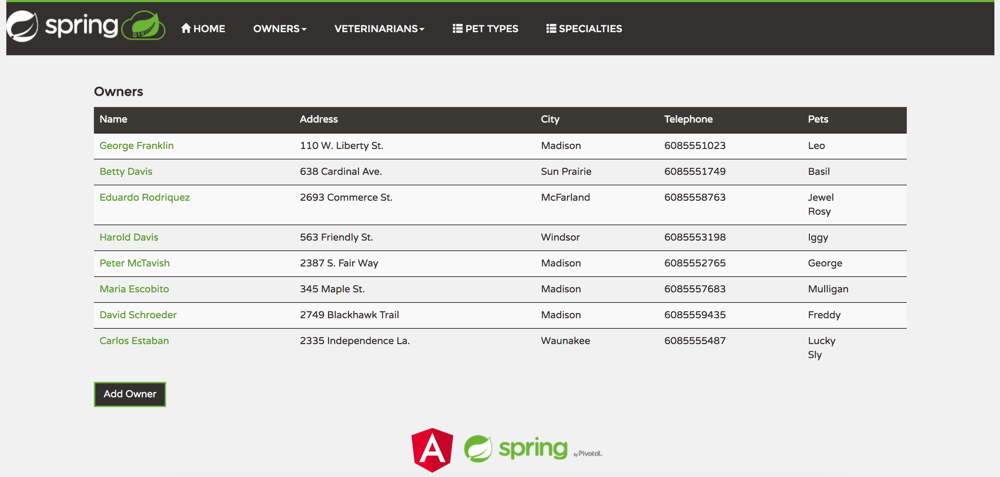

# pet-clinic
Pet clinic is a sample application that showcases the use of kotlin in building spring boot applications 

### https://www.codingame.com/playgrounds/13898/more-complex-modelling-with-spring-data-cassandra
###  https://medium.com/@aamine/spring-data-for-cassandra-a-complete-example-3c6f7f39fef9

 

copyright [awesomeopensource.com](https://awesomeopensource.com/project/spring-petclinic/spring-petclinic-rest)